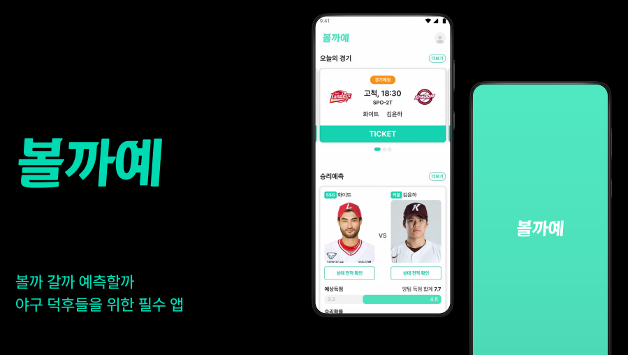
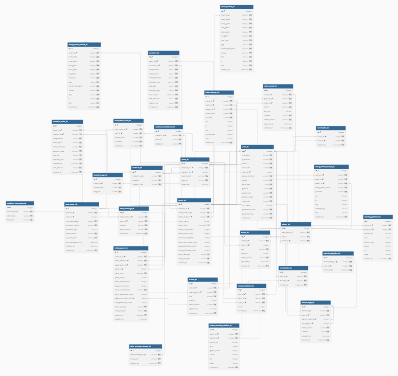
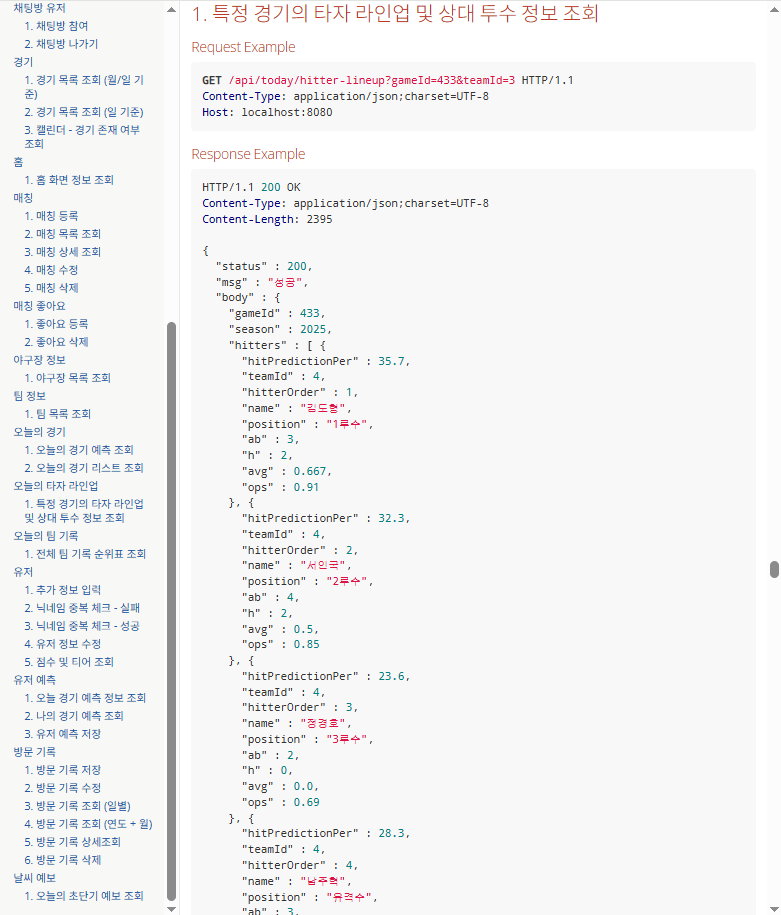
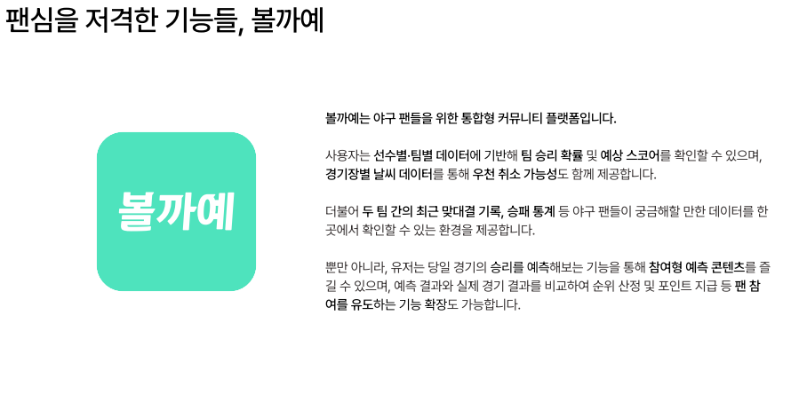
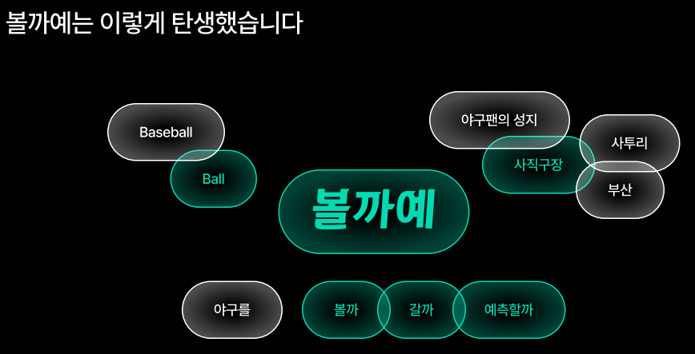
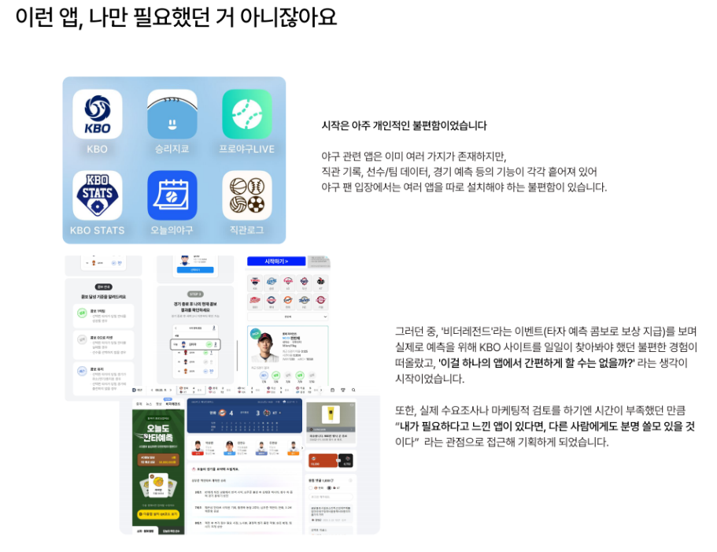

# KBO 팬들을 위한 올인원 커뮤니티 플랫폼

## 🎥 시연영상
<video src="https://github.com/user-attachments/assets/d5365f12-45d8-4ed7-b648-5d919e162c7c" controls width="600"></video>

## 목차
1. [🗓️ 개발 기간 및 참여 인원](#개발기간및참여인원)
2. [🔚 회고](#회고)
3. [💡 주요 기능](#주요기능)
4. [✍️ 개인 기여도 및 역할](#개인기여도및역할)
5. [👥 백엔드-팀원](#백엔드팀원)
6. [🛠️ 기술 스택](#기술스택)
7. [🧩 문제 해결 경험](#문제해결경험)
8. [🗂️ ERD](#erd)
9. [📄 API 문서](#api문서)
10. [🧠 프로젝트 소개](#프로젝트소개)

## 🗓️ 개발 기간 및 참여 인원
- 기간: 2025.06.16 ~ 2025.07.17
- 인원: 6인 팀 프로젝트

## 🔚 회고

1️⃣ **협업을 통해 시야를 넓히다**

**이전 프로젝트에서는 팀장이 DB 설계부터 서버 세팅까지 혼자 도맡아 진행**했지만, 이번 프로젝트에서는 백엔드 팀원들과 함께 **DB 설계를 공동으로 진행**했습니다.
직접 함께 설계를 해보니, 이전에 팀장이 혼자 해냈던 일이 얼마나 어려운 작업이었는지를 몸소 느꼈고, 그 과정에서 **동료의 역량을 인정하고 존중하는 태도의 중요성**을 깨달았습니다.
협업을 통해 역할을 나누고 깊이 있게 완성해가는 과정이 얼마나 효율적인지도 경험할 수 있었습니다.

2️⃣ **크롤링의 한계를 마주하며 성장**

개발 전 크롤링 샘플링을 진행했지만, **KBO 공식 사이트가 JS 기반 동적 페이지**로 구성돼 있어 예상보다 크롤링 난이도가 높았습니다. 라인업 테이블이 실시간으로 채워지는 구조라 **정확한 크롤링 타이밍**과 **정제 방식**을 계속 수정해야 했고, 페이지 구조가 자주 바뀌어 유지 보수도 어려웠습니다.
특히, **타자 라인업과 투수 맞대결 데이터**를 모두 수집하기 위해 **라인업 크롤링 후 선발 투수와 타자 전적까지 연결**해야 했고, 경기 시작 전까지 타이밍을 맞춰야 해서 실제 크롤링 로직 구현과 테스트에 **생각 이상으로 많은 시간이 소요**되었습니다.

3️⃣ **도전에서 얻은 보람**

비록 완벽하게 마무리하진 못했지만, 이전 프로젝트보다 **더 복잡한 로직에 도전하며 많은 것을 배웠고**, 어려운 상황 속에서도 협업과 기술적 도전을 즐길 수 있었습니다. 앞으로도 지속적으로 개선하고 발전하는 개발자가 되기 위해 노력할 것입니다.

## 💡 주요 기능
- 팀·선수별 데이터 기반 승리 예측 & 스코어 예측
- 날씨 데이터 연동을 통한 경기 우천 취소 예측
- 최근 팀 간 전적 / 승패 통계 / 타자 vs 투수 대결 기록 등 통계 제공
- 동행 모집 / 직관 기록 / 팬 활동 기록 관리.
- 예측 콘텐츠 제공 및 리워드 시스템
  - 사용자가 경기 승리팀을 예측하면 포인트를 획득하고, 누적 포인트에 따라 티어(등급)가 상승하는 구조로, 팬의 참여도를 높이고 재미 요소를 강화

## ✍️ 개인 기여도 및 역할
### 개인
- 타자 라인업 크롤링
    - KBO 공식 사이트에서 각 경기의 타자 라인업 데이터 수집하여 저장
- 선발 투수 라인업 크롤링
    - KBO 공식 사이트에서 선발 투수 정보를 크롤링하여 저장
- 기상청 날씨 API
    - 기상청 단기/초단기 예보 API를 통해 경기장별 날씨 정보 저장
- 우천 취소 예측
    - 날씨 및 기상 데이터를 기반으로 경기 우천 취소 여부 예측 기능
- 경기 전력분석 기능 상대 전적
    - 두 팀 간의 최근 맞대결 전적 통계 조회 기능
- 직관 기록 CRUD
    - 사용자의 직관(직접 관람) 기록을 생성, 조회, 수정, 삭제하는 기능
- 알림 기능 구현 (FCM)
    - 선발 투수 확정, 경기 시작 시간 등 주요 이벤트 발생 시 사용자에게 푸시 알림 전송
- 사용자 맞춤형 홈 화면 개발
    - 앱 첫 화면 구성 및 사용자 맞춤형 주요 정보 표시

### 공통
- ERD/테이블 설계
    - 기초테이블, 행위테이블 설계
- 컨벤션, Git 형상관리 방식 기획
    - Git에 서버용 레파지토리 2개와 Flutter앱용 레파지토리 생성
    - 기본적인 컨벤션을 예전 프로젝트들로 부터 참고하여 작성

## 👥 백엔드 팀원
<table>
  <thead>
    <tr>
      <th>백하림</th>
      <th>김정원</th>
      <th>김미숙</th>
    </tr>
  </thead>
  <tbody>
    <tr>
      <td></td>
      <td></td>
      <td></td>
    </tr>
    <tr>
      <td>BE / PL</td>
      <td>BE</td>
      <td>BE</td>
    </tr>
    <tr>
      <td><a href="https://github.com/harimmon">GitHub</a></td>
      <td><a href="https://github.com/hahamik">GitHub</a></td>
      <td><a href="https://github.com/parangdajavous">GitHub</a></td>
    </tr>
  </tbody>
</table>

## 🛠️ 기술 스택
| 구분 | 내용 |
|------|------|
| **Language & Framework** |   |
| **크롤링** |   |
| **에러 로깅** |  |
| **인증** |   |
| **배포 및 환경** |   |
| **API 문서화** |  |
| **테스트** |  |
| **기타** |    |
| **로컬 개발용 DB** |   |
| **운영 DB** |  |
| **협업 도구** |    |

## 🧩 문제 해결 경험
### 🔔 문제1 : Redis Pub/Sub + Docker 기반 -> FCM 기반 알림 시스템으로 전환
- **✅ 문제 상황**
    - 초기에는 **Redis Pub/Sub + Docker** 기반의 실시간 알림 시스템을 고려했으나,
        - 메시지 전송의 **신뢰성 부족**
        - **구독자 수만큼 메시지를 전송**해야 하므로 성능 문제 발생
        - Docker 환경 운영의 부담
        - **운영 및 유지보수에 불필요한 복잡도**
- **🔧 해결 방법**:
    - **Redis와 Docker를 제거하고**, Spring Boot 서버에서 **Firebase Admin SDK**를 이용한 **직접 메시지 전송 방식**으로 전환
    - 이벤트 발생 시 `FirebaseMessaging.send()`로 **FCM 직접 호출**
    - 구조 단순화 + 알림 안정성 확보 + 운영 편의성 개선
- 💡 **느낀 점**
    - 구조를 복잡하게 설계하는 것이 반드시 좋은 결과를 주는 것은 아님
    - 서비스 성격에 따라 적절한 **기술 선택과 유연한 전환 판단**이 중요함을 경험함

### 🔐 문제2 : Git 커밋에 민감 정보 포함 → Push 차단

- **✅ 문제 상황**
    - `Firebase 서비스 계정 키`를 프로젝트에 커밋한 후 GitHub로 푸시 시도 → **Push 차단**
    - GitHub의 **Push Protection 기능**이 `비밀 키 포함`을 탐지하여 푸시를 거부
    - 이미 커밋된 상태라 단순히 파일 삭제로는 해결 불가
- **🔧 해결 방법**
    - **BFG Repo-Cleaner** 도구 사용
        - 과거 Git 기록에서 해당 키를 완전히 제거
        - 민감 정보가 **히스토리에 남지 않도록 완전 삭제**
- **💡 느낀 점**
    - 실수로 인한 민감정보 노출은 누구나 할 수 있는 실수지만, **Git 관리의 중요성**과 함께 **BFG 등 복구 도구에 대한 사전 학습**이 실무에서도 매우 유용함을 느꼈음
 

## 🗂️ ERD

## 📄 API 문서

## 🧠 프로젝트 소개

**볼까예**는 야구 팬들을 위한 통합형 커뮤니티 플랫폼입니다.
선수별·팀별 데이터를 기반으로 한 경기 예측, 응원, 직관 기록 등
다양한 팬 활동을 한곳에서 수행할 수 있는 서비스를 목표로 합니다.

### ❓ 주제 선정 이유

**1. 야구 팬의 불편한 현실**

- 야구 팬들은 KBO, 선수 데이터, 경기 예측, 직관 등 기능을 위해 **여러 개의 앱을 따로 설치해야 했음**
- 기능들이 흩어져 있어 **경험의 단절**과 **접근성의 불편**을 초래함
- 개인적으로 ‘이걸 하나의 앱에서 해결할 순 없을까?’라는 의문에서 출발

**2. 팬심을 위한 진짜 기능**

- 단순한 정보 제공을 넘어, 팬들이 **몰입감 있게 사용할 수 있는 예측형 콘텐츠와 기록 기능** 추가
- 팬들의 행동 데이터(예측 결과, 직관 기록 등)를 바탕으로 **참여형 순위제와 보상 시스템** 확장 가능성 고려
